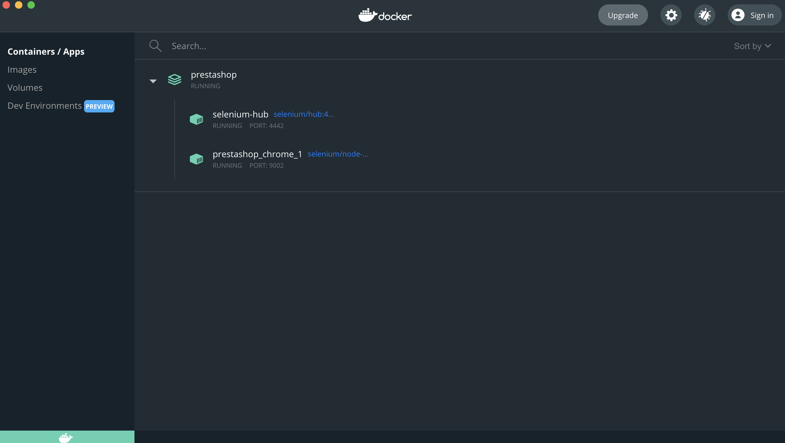
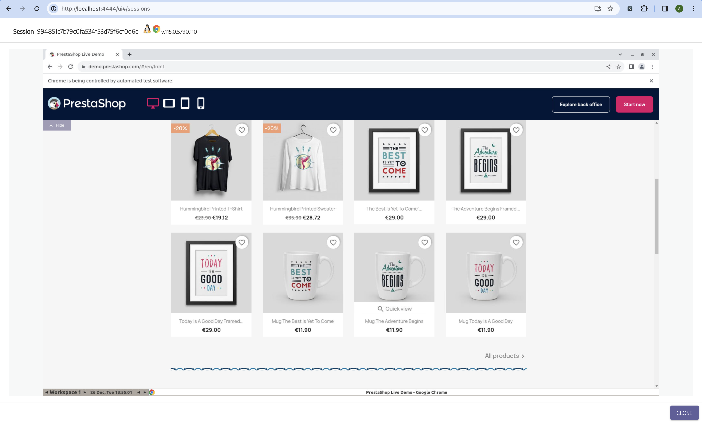
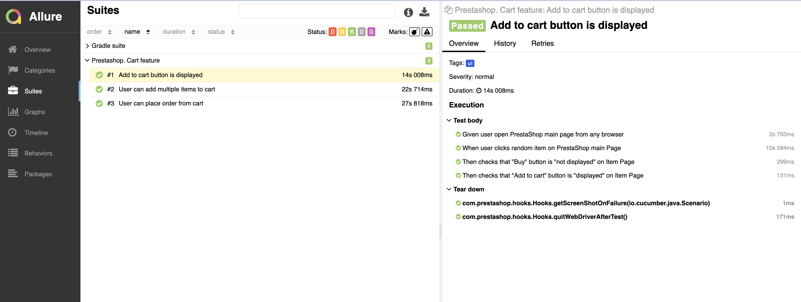

# Mobile framework

## Table of contents

* [Environment Settings](#environment-settings)
    * [General](#general)
* [How to run tests](#how-to-run-tests)

## Environment Settings

### General

1. Java 11 or later
2. Git
3. Gradle

## How to run tests

1. Open desktop Docker app
2. From command line from project's root:
    ``docker-compose up -d``

3. From command line from project's root:
   - For local run: ``./gradlew clean executeUITests`` 
   - For remote run: ``./gradlew clean executeUITests -DBROWSER='remote'``
   You can open Selenoid Grid on the next local host: http://localhost:4444/ui#/sessions

4. Generate Allure Report:
    ``./gradlew allureReport``
   You can open Allure Report here: ``build/reports/allure-report/allureReport/index.html``

